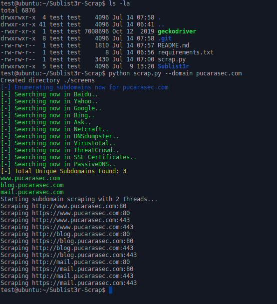

# Sublist3r-Scrap

Sublist3r-Scrap is a fork of Sublist3r which also implements scraping for each page. Just input the domain (or load a domain list from a file), and it will take a **screenshot** of each web page, in the ports specified, trying both **HTTP** and **HTTPS**

## Installation

- Sublist3r-Scrap uses the Firefox geckodriver, which can be downloaded from [here](https://github.com/mozilla/geckodriver/releases). Once downloaded, the decompressed file needs to be on the same folder as the python script. Once decompressed, run the following script to add it to the path, from the main folder:

```bash
export PATH=$PATH:$(pwd)
```

- Sublist3r-Scrap needs the selenium and other libraries, which can be downloaded via pip:
```bash
pip install -r requirements.txt
```

## Usage

```bash
usage: scrap.py [-h] [--domain DOMAIN] [--url_list URL_LIST]
                [--threads THREADS] [--ports PORTS] [--dir DIR]

Scraper for subdomain lists.

optional arguments:
  -h, --help           show this help message and exit
  --domain DOMAIN      Base domain to use with Sublist3r.
  --url_list URL_LIST  Use a text file with urls instead.
  --threads THREADS    Concurrent threads to run. (Default: 2)
  --ports PORTS        Comma separated ports to use with sublist3r and the
                       scraper. (Default: 80,443)
  --dir DIR            Target directory for screenshots. (Default: ./screens)
```

## Example image



## Contributing
Pull requests are welcome. For major changes, please open an issue first to discuss what you would like to change.

Please make sure to update tests as appropriate.

## License
Sublist3r-Scrap uses the same license as its parent project, which is licensed under the GNU GPL license. take a look at the [LICENSE](https://github.com/aboul3la/Sublist3r/blob/master/LICENSE) for more information.